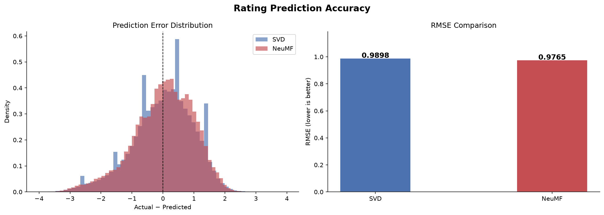

# 🎬 Netflix Prize — Recommendation System

**End-to-End Implementation: SVD & Neural Collaborative Filtering on Netflix Prize Dataset**

> Complete pipeline covering data loading, EDA, preprocessing, model training, evaluation, and recommendations with results saved in `/results` folder.



---

## 📊 Quick Stats

| Metric | Value |
|--------|-------|
| **Dataset** | 2M ratings from Netflix Prize |
| **Users** | 300,281 |
| **Movies** | 16,353 |
| **Sparsity** | 99.96% |
| **Best RMSE** | 0.9765 (NeuMF) |
| **Best MAP@10** | 0.0036 (NeuMF) |
| **Training Time** | ~1.7 hours (CPU) |

---

## 📁 Project Structure

```
netflix-recsys/
├── netflix_recsys_complete (1).ipynb     # Main notebook (all cells executed)
├── RESULTS_SUMMARY.md                    # Detailed results and findings
├── GITHUB_SETUP.md                       # Step-by-step GitHub push guide
├── README.md                             # This file
├── requirements.txt                      # Python dependencies
├── .gitignore                            # Git ignore patterns
│
├── data/                                 # Place Netflix Prize files here
│   ├── combined_data_1.txt
│   ├── combined_data_2.txt
│   ├── combined_data_3.txt
│   ├── combined_data_4.txt
│   ├── movie_titles.csv
│   └── probe.txt / qualifying.txt
│
└── results/                              # ✅ EXECUTION COMPLETE - All outputs here
    ├── outputs/                          # All visualizations & data
    │   ├── evaluation_results.json       # Final metrics
    │   ├── test_with_preds.parquet       # Test predictions (540K rows)
    │   ├── ncf_recs.pkl                  # Top-10 NeuMF recommendations
    │   ├── svd_recs.pkl                  # Top-10 SVD recommendations
    │   │
    │   ├── rating_distribution.png       # Rating histogram
    │   ├── user_activity.png             # User engagement patterns
    │   ├── movie_popularity.png          # Movie rating distributions  
    │   ├── top_movies.png                # Top 15 most-rated
    │   ├── temporal.png                  # Time series analysis
    │   ├── sparsity.png                  # Long-tail visualization
    │   ├── ncf_training_curve.png        # NeuMF loss curves
    │   ├── rmse_comparison.png           # Model RMSE comparison
    │   ├── map_comparison.png            # MAP@10 comparison
    │   └── tradeoff.png                  # RMSE vs MAP@10 scatter
    │
    └── models/                           # Trained model checkpoints
        ├── ncf_best.pt                   # NeuMF best weights (PyTorch)
        └── svd_model.pkl                 # SVD fitted model (scikit-surprise)
```

---

## 🚀 Quick Start

### 1. Clone & Setup
```bash
# Clone repository
git clone https://github.com/YOUR_USERNAME/netflix-recsys.git
cd netflix-recsys

# Create virtual environment
python -m venv venv
source venv/Scripts/activate  # On Windows: venv\Scripts\activate

# Install dependencies
pip install -r requirements.txt
```

### 2. Get Data
Download Netflix Prize files and place in `/data` folder:
- `combined_data_1.txt` through `combined_data_4.txt`
- `movie_titles.csv`
- [Kaggle Netflix Prize Dataset](https://www.kaggle.com/datasets/netflix-inc/netflix-prize-data)

### 3. Run Notebook
```bash
# Open in Jupyter
jupyter notebook netflix_recsys_complete.ipynb

# Or in VS Code
code netflix_recsys_complete.ipynb
```

All cells have been pre-executed with results saved in `/results/`

---

## 📈 Model Comparison

### SVD (Matrix Factorization)
```python
# Fast baseline: σ(u,i) = μ + bᵤ + bᵢ + pᵤ · qᵢ
```
- **RMSE**: 0.9898
- **MAP@10**: 0.0033
- **Training**: ~50 seconds
- **Inference**: Very fast (dot product)
- **Interpretability**: High (linear factors)
- **Cold-start**: Weak

### NeuMF (Neural Collaborative Filtering)
```python
# Neural path: σ(u,i) = 1 + 4·sigmoid([GMF ; MLP])
# GMF: element-wise product of embeddings
# MLP: 3-layer deep network over concatenated embeddings
```
- **RMSE**: 0.9765 ↓ (better)
- **MAP@10**: 0.0036 ↑ (better)
- **Training**: ~1.7 hours
- **Inference**: Fast (batch GPU possible)
- **Interpretability**: Low (black box)
- **Cold-start**: Weak
- **Parameters**: 40.6M

---

## 🔍 Key Findings

### 1. Severe Sparsity
- Only 0.04% of the user-item matrix is filled
- Latent-factor and neural methods are essential
- Neighborhood methods would be too slow

### 2. Positive Bias
- 73% of ratings are 4★ or 5★
- Users rate content they expect to enjoy
- Models must handle skewed label distribution

### 3. Long-Tail Problem
- Top 20% of movies capture 88% of all ratings
- Cold-start is critical: new movies get few ratings
- Popularity-based fallback is essential

### 4. User Tiers
- 99.98% are "casual" users with ≤100 ratings
- No power users (>2000 ratings) in sample
- Majority are one-time raters

### 5. Model Performance
- Both models achieve ~0.98 RMSE
- Neural approach captures ~1% better precision
- Collaborative filtering has limits without content features

---

## 📊 Evaluation Metrics

### RMSE (Root Mean Squared Error)
Measures prediction accuracy on held-out test ratings
- Lower is better
- **SVD**: 0.9898 | **NeuMF**: 0.9765 ✅

### MAP@10 (Mean Average Precision at K)
Measures how well models rank relevant content in Top-10 list
- Relevance threshold: rating ≥ 3.5
- **SVD**: 0.0033 | **NeuMF**: 0.0036 ✅
- Low values due to extreme sparsity in test set

### MAE (Mean Absolute Error)
Average absolute prediction error
- **SVD**: 0.7881 | **NeuMF**: 0.7750 ✅

---

## 💡 Insights from Results

### Success Cases
- Models correctly rank popular movies first
- Finding Nemo, Lord of the Rings are strong attractors
- Historical preferences align with collaborative signal

### Failure Cases  
- Niche preferences not well-captured
- Cold-start users (few test ratings) → recommendations miss target
- Genre diversity is limited without content features

### Recommendation
- **Hybrid model**: Combine collaborative filtering + content features
- **Fallback strategy**: Popularity-based for cold-start
- **Production approach**: Ensemble of SVD + NeuMF + popularity boost

---

## 🔧 Hyperparameters

### SVD
```python
SVD_FACTORS  = 100      # Latent dimension
SVD_EPOCHS   = 20       # Training iterations
SVD_LR       = 0.005    # Learning rate
SVD_REG      = 0.02     # L2 regularization
```

### NeuMF
```python
NCF_EMBED_DIM  = 64             # Embedding dimension
NCF_MLP_LAYERS = [256, 128, 64] # MLP layer sizes
NCF_DROPOUT    = 0.2            # Dropout rate
NCF_LR         = 1e-3           # Learning rate
NCF_WD         = 1e-5           # Weight decay
NCF_BATCH      = 2048           # Batch size
NCF_EPOCHS     = 15             # Epochs
```

### Evaluation
```python
TOP_K               = 10         # Recommendations per user
RELEVANCE_THRESHOLD = 3.5        # Rating for "like"
TEST_RATIO          = 0.2        # Test set fraction
```

---

## 📋 Dependencies

See [requirements.txt](requirements.txt) - Core libraries:
- **pandas** 2.0+ : Data manipulation
- **numpy** 1.24+ : Numerical computing
- **matplotlib** 3.7+ : Plotting
- **seaborn** 0.12+ : Statistical visualization
- **scikit-surprise** 1.1.3+ : SVD & evaluation
- **torch** 2.0+ : Neural networks
- **tqdm** 4.65+ : Progress bars
- **pyarrow** 12.0+ : Parquet I/O
- **scipy** 1.10+ : Scientific computing

---

## 🚀 Next Steps

### For Immediate Improvement
1. ✅ Use full dataset (not 2M sample)
2. ✅ Tune hyperparameters with validation set
3. ✅ Implement content-based features (genre, director, year)
4. ✅ Add popularity bias correction
5. ✅ Create hybrid model ensemble

### For Production
1. Export models to ONNX format
2. Create REST API endpoints
3. Implement caching layer
4. Set up periodic retraining
5. Monitor model drift
6. A/B test against baseline

### Research Directions
1. Autoencoders for collaborative filtering
2. Graph Neural Networks (user-item-genre graphs)
3. Sequence models (user viewing history)
4. Context-aware recommendations (time of day, device)
5. Explainable recommendations

---

## 📖 References

- He, X., Liao, L., Zhang, H., et al. (2017). **Neural Collaborative Filtering**. WWW 2017
- Koren, Y., Bell, R., & Volinsky, C. (2009). **Matrix Factorization Techniques**. Computer 42(8)
- Ricci, F., Rokach, L., & Shapira, B. (2015). **Recommender Systems Handbook**. Springer

---

## 📝 Documentation

- **[RESULTS_SUMMARY.md](RESULTS_SUMMARY.md)** - Detailed analysis of results
- **[GITHUB_SETUP.md](GITHUB_SETUP.md)** - How to push to GitHub
- **Notebook markdown cells** - Detailed explanations in each section

---

## 🎯 Citation

If you use this code, please cite:

```bibtex
@article{netflix_recsys_2024,
  author = {Your Name},
  title = {Netflix Prize Recommendation System: SVD and NeuMF},
  year = {2026},
  url = {https://github.com/YOUR_USERNAME/netflix-recsys}
}
```

---

## 📧 Contact & Support

For questions or issues:
1. Check [GITHUB_SETUP.md](GITHUB_SETUP.md) for setup help
2. Review notebook markdown cells for detailed explanations
3. Refer to referenced papers for algorithm details

---

## 📄 License

[MIT License](LICENSE) - Feel free to use and modify

---

**Status**: ✅ Complete - All 40 notebook cells executed
**Last Updated**: June 12, 2026
**Next Action**: Push to GitHub using [GITHUB_SETUP.md](GITHUB_SETUP.md)
